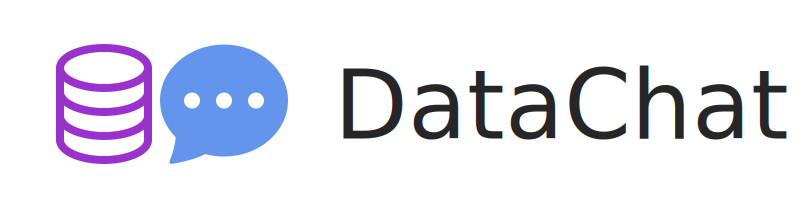
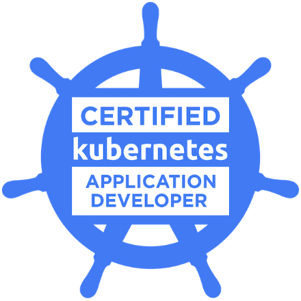
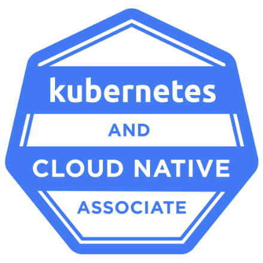
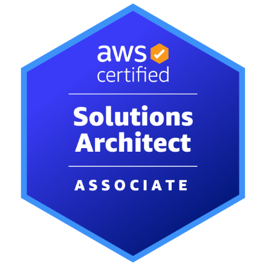
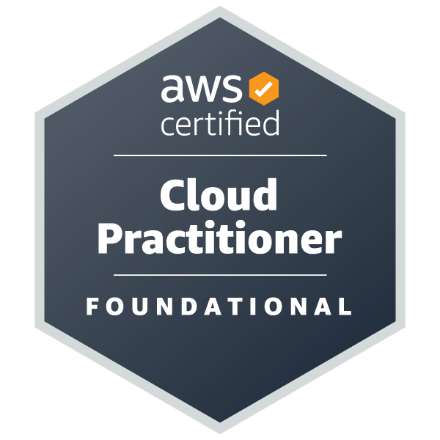

# Software Developer ✨

&nbsp;&nbsp;

&nbsp;&nbsp;

&nbsp;&nbsp;

&nbsp;&nbsp;

 

## [DataChat](https://github.com/mslapek/datachat) – Fullstack Pet Project ☕️

**Backend:** Java, Spring WebFlux
 
**Frontend:** TypeScript, React, Redux

[DataChat](https://github.com/mslapek/datachat) – Quick data exploration as a chat!

* DataChat connects to any PostgreSQL database.
* It allows you to explore your data in a form of chat.
* **Easy setup in 5 minutes** ⏰ – with Docker Compose!

See [DataChat GitHub repo there](https://github.com/mslapek/datachat)!

  

## Cloud Certs ☁️

<small>**Click the badge** to verify a cert.</small>

**Kubernetes (The Linux Foundation)**

&nbsp;
&nbsp;
&nbsp;

  

**Amazon Web Services (AWS)**

&nbsp;
&nbsp;
&nbsp;

  

**Google Cloud Platform (GCP)**

&nbsp;
&nbsp;
&nbsp;

  

## Python Project 🐍

[letstune](https://github.com/mslapek/letstune) Python package facilitates Machine Learning through hyperparameter tuning.

The package sports nice architecture, static typing with mypy
and unit tests with pytest. Linting and tests are run with
GitHub Actions on CI.

  

## Open-source contributions 🗂️

 

**TRAC &nbsp;•&nbsp; Java &nbsp;•&nbsp; Metadata DB about financial models**

[<code>&nbsp;#249</code>](https://github.com/finos/tracdap/pull/249) Separated gRPC calling code from the logging logic with the interceptors API

[<code>&nbsp;#212</code>](https://github.com/finos/tracdap/pull/212) Improved performance of the gRPC API with call batching

 

[All PRs](https://github.com/finos/tracdap/pulls?q=author%3Amslapek) in TRAC

  

**Apache Arrow DataFusion &nbsp;•&nbsp; Rust &nbsp;•&nbsp; Modular SQL Query Engine**

[`#5623`](https://github.com/apache/arrow-datafusion/pull/5623) Added cycle detection to the logical optimizer loop with extensive unit testing

[`#5734`](https://github.com/apache/arrow-datafusion/pull/5734) Fixed an SQL typing bug with case expression, verified with PostgreSQL integration tests

[`#5521`](https://github.com/apache/arrow-datafusion/pull/5521) Removed lots of boilerplate required to implement custom nodes of logical plan with nice inheritance of the hashing/equality implementation

 

[All PRs](https://github.com/apache/arrow-datafusion/pulls?q=author%3Amslapek) in Apache Arrow DataFusion

  

**Polars &nbsp;•&nbsp; Rust &nbsp;•&nbsp; DataFrames for Python with lazy data loading**

[`#7143`](https://github.com/pola-rs/polars/pull/7143) Added glob pattern support to the JSON read routine, available in Rust and Python API

[`#7250`](https://github.com/pola-rs/polars/pull/7250) Replaced unsafe code related to the schema of CSV with safe alternative

 

[All PRs](https://github.com/pola-rs/polars/pulls?q=author%3Amslapek) in Polars

  

## Cool Article 📰

["Go vs Rust: A Sto-array of Arrays"](https://hackernoon.com/go-vs-rust-a-sto-array-of-arrays), Hackernoon, 2022

  

See [more text](more.md) for info about academic stuff.